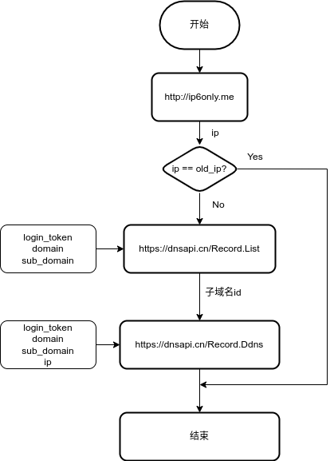

# 基于树莓派的智能家居系统设计

## 封面

## 中文摘要

## 外文摘要

## 目录

## 正文

### 第一章 绪论

#### 研究目的及意义

#### 国内外{发展,研究}现状

### 第二章 硬件平台

#### 硬件设备

##### 树莓派

##### arduino

##### esp32

> wifi

连接 wifi
自定义主机名 ESP32

> mqtt

> 中断

- 中断 1 mqtt 主题
- 中断 2 wifi 通断

#### 传感器

##### 温湿度传感器

DHT-11

##### 人体传感器

HC-SR501

##### 声音传感器

##### 光传感器

##### 门窗传感器

#### 语音控制模块

SU-10A
小爱同学

#### 摄像模块

### 第三章 软件平台

#### linux

树莓派官方 64 位系统，基于 Debian

#### docker

docker 是使用操作系统级虚拟化

#### homeassistant

#### MQTT

MQTT（Message Queuing Telemetry Transport）是 ISO 标准下基于发布/订阅范式的消息协议

> broker

docker:emqx

```emqx
docker run -d --restart always --name emqx -p 1883:1883 -p 8083:8083 -p 8084:8084 -p 8883:8883 -p 18083:18083 emqx/emqx
```

可用 docker-compose 代替

面板控制端口：18083
mqtt 端口：1883
mqtt with ssl 端口：8883

默认用户名：admin
默认密码：public

> client

shell:mosquitto

mosquitto_sub -h localhost -t test
mosquitto_pub -h localhost -t test -m 'test'


python:paho.mqtt
c:<PubSubClient.h>

#### opencv

获取摄像头图像，显示色彩图像，检测用灰度图
加载官方训练好的人脸分类器，使用 LBPH 方法

### 第四章 管理

#### 前端管理

flask 是一个轻量级的web框架。


hass 侧边仪表盘添加网页卡片（可以不用 supervisor）
将私人配置和 opencv 的都基于 flask 开发
将私人配置和 特人 opencv 的都基于 flask 开发
只在访问时用 flask,其余都在后台运行

#### 远程管理

##### IP地址

谈起计算机的地址时一般指两种地址，一种是 MAC 地址，另一种是 IP 地址。MAC 地址是物理地址又称硬件地址，而 IP 地址是一个逻辑地址。IP地址在网络中是唯一的地址，由于这种唯一性使得网络中的计算机彼此之间能相互通信。IP 地址用二进制表示，目前常用的是 IPv4 和 IPv6 ，分别表示网际协议的第 4 版和第 6 版。IPv4 地址由 32 位的二进制数表示,为方便使用，人们用四个十进制数来表示这 32 位的二进制数，即每 8 个二进制数用一个十进制数表示，用点号作为分隔符。IPV6 是由 128 位的二进制数组成的，类似 IPv4，人们十六进制表示 IPv6 ，每一个十六进制数表示 16 位二进制数,一共用 8 个十六进制数，用冒号分隔。[1]
现在绝大多数计算机都在使用 IPv4 地址，但限于地址空间长度，IPv4 地址已于 2019 年 11 月耗尽了。国内的 IPv4 地址相较于国外来说少得多，一般都是根据 NAT 技术来实现 IP 的分发，从而形成大型局域网，用户上网不会受影响。虽然 NAT 缓解了国内 IPv4 地址的紧张，但不能掩饰 IPv4 地址不足的缺点。IPv6 具有比 IPv4 大几个数量级的编码地址空间，理论上可以为每一台计算机，甚至每一片单片机分发IP地址，因此即使对于个人来说也是非常容易获取一个公网 IP。


介绍 ipv6 优点、国内外发展状况，与 ipv4 的区别
与内网穿透的优劣性比较，突出 ipv6 优点
简单介绍国家开始推广 ipv6

##### 相关政策
国家相关部门注意到 IPv6 发展的困境，迅速出台多项政策，加快 IPv6 的部署速度。

2017 年 11 月，中共中央办公厅、国务院办公厅联合印发《推进互联网协议第六版（IPv6）规模部署行动计划》（简称《计划》），明确提出了未来 5～10 年我国基于 IPv6 的下一代互联网发展的总体目标、路线图、时间表和重点任务，成为加快推进我国 IPv6 规模部署、促进互联网演进升级和创新发展的行动指南。

2019 年，我国发布《中国 IPv6 发展状况》白皮书和“国家 IPv6 发展监测平台”；成立“IPv6+”技术创新工作组，明确“IPv6+”技术研究和产业实践“三步走”发展战略。

2021 年 7 月，工信部、中央网信办联合印发《IPv6 流量提升三年专项行动计划（2021—2023 年）》，从网络和应用基础设施服务性能、主要商业互联网应用 IPv6 浓度、支持 IPv6 的终端设备占比等方面提出了量化目标。这一计划的出台标志着我国 IPv6 发展在经过网络就绪、端到端贯通等关键阶段后，正式迈入了“流量提升”时代。

2021 年 7 月，中央网信办、国家发展改革委、工信部发布了《关于加快推进互联网协议第六版 (IPv6) 规模部署和应用工作的通知》，提出到 2023 年末以及到 2025 年末的分阶段 IPv6 发展目标。

2021 年 11 月，工信部发布《“十四五”信息通信行业发展规划》，明确提出“十四五”时期要提升 IPv6 端到端贯通能力，提升 IPv6 网络性能和服务水平，实现 IPv6 用户规模和业务流量“双增长”，以此推动 IPv6 与 AI、云计算、工业互联网、IoT 等融合发展，并在重点行业开展“IPv6+”创新技术试点以及规模应用，增强 IPv6 网络对产业数字化转型升级的支撑能力。

2022 年 3 月，中央网信办、国家发展改革委、工信部、教育部、科技部等 12 部门联合下发“IPv6 技术创新和融合应用试点名单”，加快推动 IPv6 关键技术创新、应用创新、服务创新、管理创新持续突破。

2022 年 4 月，中央网信办、国家发展改革委、工信部联合印发《深入推进 IPv6 规模部署和应用 2022 年工作安排》，明确提出 2022 年工作目标：到 2022 年末，IPv6 活跃用户数达到 7 亿，物联网 IPv6 连接数达到 1.8 亿，固定网络 IPv6 流量占比达到 13%，移动网络 IPv6 流量占比达到 45%。

在相关部门多项政策的持续推动下，我国 IPv6 规模部署成效显著，多项 IPv6 能力步入世界前列。截至 2022 年 7 月，我国 IPv6 活跃用户数达 6.97 亿；固定网络 IPv6 流量占比达 10%，移动网络 IPv6 流量占比达 40%，整体发展势头良好；主要网站和互联网应用的 IPv6 支持度持续提升；我国移动网络 IPv6 流量从无到有，占比已经突破 40%。


IPv6具有相较与IPv4大得多的编码地址空间。这是因为IPv6采用128位的地址，而IPv4使用的是32位。因此新增的地址空间支持2128（约3.4×1038）个地址。


2001:250:3401:61f0::30c6:ceb7/128

##### 内网穿透

一般来说，家庭的 IPv4 地址并不是公共网络中的 IPv4 地址，而是通过 NAT 技术层层分发下的大内网地址。由于使用了 NAT 技术的网络，网络数据发起必须有内网向外网发起，外网是不能直接向内网主机发起请求，这就导致了很多基于 P2P 技术的软件连接失败的问题。内网穿透，也即 NAT 穿透，进行 NAT 穿透是为了使具有某一个特定源 IP 地址和源端口号的数据包不被 NAT 设备屏蔽而正确路由到内网主机。[2,3]
内网穿透需要公网 IPv4 地址进行转发，所以可以购买云服务器，可获取公网 IPv4 地址。frp 是一个专注于内网穿透的高性能的开源反向代理应用。可以通过在云服务器上部署 frp 服务实现内网穿透。frp 将树莓派上的某一个端口映射到云服务器上的某个端口，实现在外地访问本课题的 web 服务。
虽然内网穿透很方便，但依旧有一些难以解决的缺点，比如依赖其他的公网 IP、带宽低等。内网穿透的带宽取决于云服务器或者内网穿透提供商的带宽，但一般来说，云服务器的宽带价格比一般家庭用的价格高很多，所以一般家庭无法进行高带宽的内网穿透。
内网穿透本质上还是通过公网 IP 实现访问，不过这个公网 IP 却不是电信公司提供的。我们可以使用新的 IPv6 技术搭配 DDNS 技术实现外网访问的功能。


##### DDNS

IPv4 由 32 位的二进制数组成，即便是使用十进制数表示，对于人们来说，仍然难以记忆不规则的IPv4 地址，而 IPv6 更是不方便记忆。对于这种情况，DNS（Domain Name System）就是一种有效的解决办法。DNS是互联网的一项服务，可将IP地址映射到一个或多个域名。可以将DNS 看作通讯录，直接向域名（名字）发起（拨号）访问而不需要记录 IP （号码）。家庭 IP 地址是由电信公司分发下来的，但电信公司并不保证 IP 地址永久固定。DNS 只是提供了域名和地址之间的静态对应关系，当 IP 地址发生变化时，DNS 无法动态地进行更新，域名和 IP 地址之间仍保持改变之前对应关系，从而导致访问失败。[4]
DDNS（Dynamic DNS）是把域名指向动态 IP 地址的服务。作者的域名 hackzhu.com 托管于 DNSPod。DNSPod 是中国第一大 DNS 解析服务提供商、第一大域名托管商，为用户提供了很多大量的 API。通过 DNSPod 提供的 DDNS API，我们可以把树莓派的 IPv6 地址解析到子域名 home.hackzhu.com 上。
树莓派上的 IPv6 地址是很容易获取的，但有些特殊的地区不支持每一个设备都分发一个 IPv6 地址，比如广西大学的宿舍只能给接入宿舍网口的设备分发一个公网 IPv6 地址，无法通过路由器下发，一般家庭没有这个限制。我们可以通过一些可以返回访问地址的网址获取我们的 IPv6 地址，本课题使用的是http://ip6only.me 。
使用 DNSPod 的 DDNS API，需要知道子域名的 id 值才能更改解析值。程序流程图如下



### 语音控制

> snowboy

snowboy是一个具备高度自定义的开源热词检测引擎。它


snowboy发布组织KITT.AI在2020年3月停止了他们的官方网站及其API，所以无法在进行在官网上训练自己的唤醒词

https://github.com/seasalt-ai/snowboy

https://snowboy.hahack.com/

科大讯飞语音识别服务

程序流程：
snowboy 语音唤醒->pyaudio 录音生成 wav 文件->上传迅飞获取返回值

### 第五章 结论

## 参考文献

[1]冯世科.计算机网络中IP地址应用研究[J].软件,2023,44(01):110-112.
[2]陈磊. 基于IPv4网络内网穿越技术的研究与实现[D].电子科技大学,2012.
[3]冷静. 基于M2M的物联网网关平台设计及实现[D].西安电子科技大学,2014.
[4]孙豆豆. 面向智能家居网关的安全动态域名解析系统设计与实现[D].东南大学,2017.

## 附录

## 致谢

感谢大学四年与我一起生活学习的同学和老师。
感谢开源社区的所有开发者。

## 封底
